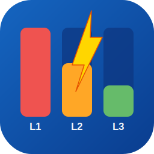

  
  <h1>Dynamic Load Balancer</h1>
  
A Home Assistant custom integration that prevents electrical overloads in residential three-phase power systems by automatically throttling EV chargers and toggling high-power devices when a phase exceeds its fuse capacity.

---

## What It Does

The integration monitors per-phase current every 5 seconds. When a phase exceeds the configured trigger threshold for a sustained period it:

1. **Reduces EV / charging current** — steps it down incrementally using a `number` entity (works with any EVSE: Tesla Wall Connector, Wallbox, go-e Charger, etc.)
2. **Turns off selected devices** — e.g. water heaters, climate units — if throttling the charger alone is not enough
3. **Sends a notification** — posts an alert to the HA dashboard and optionally to your phone
4. **Restores everything automatically** — cautiously ramps load back up once all phases have enough headroom

## Installation via HACS

1. In Home Assistant, go to **HACS → Integrations → ⋮ → Custom repositories**
2. Add this repository URL and select category **Integration**
3. Install **Dynamic Load Balancer** from the HACS store
4. Restart Home Assistant
5. Go to **Settings → Devices & Services → Add Integration** and search for *Dynamic Load Balancer*

## Manual Installation

Copy the `custom_components/dynamic_load_balancer` folder into your Home Assistant `config/custom_components/` directory and restart.

## Configuration

Setup is done through the UI wizard (4 steps):

| Step | What you configure |
|---|---|
| 1. Panel capacity | Per-phase fuse / breaker size in Amperes |
| 2. Current sensors | Sensor entities that report current (A) per phase |
| 3. Reaction behavior | Aggressiveness level and spike-filter duration |
| 4. Actions & notifications | EV charger entity, devices to toggle, notification device |

After setup you can adjust fuse size, aggressiveness, spike filter, and notification device at any time via **Settings → Devices & Services → Dynamic Load Balancer → Configure**.

## Aggressiveness Levels

| Level | Trigger threshold | Example (25 A fuse) |
|---|---|---|
| Low | 95 % of fuse | 23.75 A |
| Medium (default) | 90 % of fuse | 22.5 A |
| High | 85 % of fuse | 21.25 A |
| Very High | 80 % of fuse | 20.0 A |

## Notifications

When an overload is detected the integration always creates a **persistent notification** visible in the Home Assistant dashboard (bell icon). To also receive a **push notification on your phone**, enter your mobile device's notify service name during setup or in the options dialog.

**Finding your device name:**
1. Go to Developer Tools → Services
2. Search for `notify.` — you will see entries like `notify.mobile_app_johns_iphone`
3. Copy the part after `notify.` (e.g. `mobile_app_johns_iphone`) and enter it in the setup

## Entities Created

| Entity | Type | Description |
|---|---|---|
| `switch.dynamic_load_balancer` | Switch | Enable / disable load balancing |
| `sensor.load_balancer_last_overload` | Sensor (timestamp) | Date & time of the last overload event |

The switch entity exposes detailed state attributes (phase currents, trigger threshold, managed devices, restoration status) that can be used in automations and dashboards.

## Smart Restoration

After reducing load, the integration does **not** immediately ramp back up. It waits until:
1. All phases have at least **3 A of headroom** below the trigger threshold
2. That headroom has been **stable for 60 seconds**
3. Then it increases the charger by **one step at a time**, waiting **60 seconds** between each step to observe the effect

This prevents the oscillation (reduce → restore → overload → repeat) common with simpler load managers.

## Requirements

- Home Assistant 2023.x or newer
- At least one current sensor per phase (e.g. Shelly EM, Eastron SDM, smart meter integration)
- Optional: an EVSE that exposes a charging-current `number` entity
- Optional: a mobile device with the Home Assistant companion app installed
